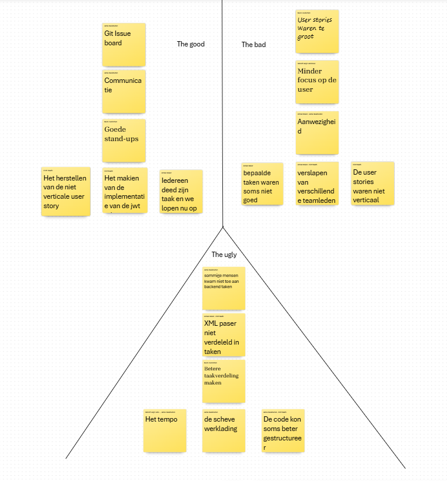
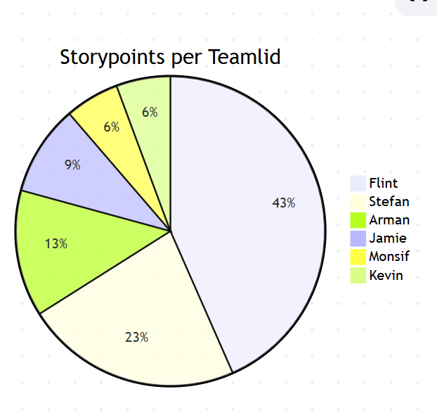

 

 
## Uitkomst retrospective

### The Good, the Bad and the Ugly

 

## Aandeel teamleden
 

De rolverdeling in het team was deze sprint niet zo goed, Flint heeft de xml parser helemaal gemaakt, terwijl deze eigen onder verdeeld moest worden, maar als reactie daarop hebben we de user stories herschreven naar vertical slices, waardoor deze sprint alles soepeler moet gaan lopen.

 
##### Eigen reflectie
 
Mijn smart doel is om minstens 2 vertical slices user stories af te krijgen deze sprint, omdat ik vorige sprint een grote issue heb gemaakt, dus probeer ik er meer te maken dan de vorige sprint.

S: Ik maak minstens 2 vertical slice user stories af.
M: Ik kan controleren of er daadwerkelijk 2 compleet zijn.
A: Ik werk deze sprint gericht aan vertical slices om dit te behalen.
R: Dit is haalbaar binnen mijn capaciteit deze sprint.
T: Binnen deze sprint.
