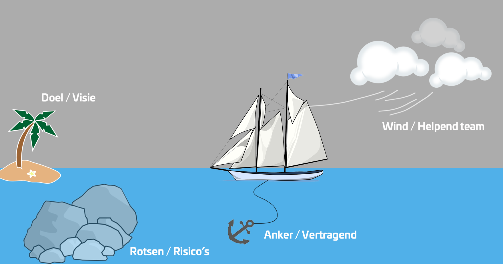

## Retro Sprint 4

### Collectieve Gedeelte

### Flint:

**Doel/Visie:**
- Een succesvol eindproduct leveren met alle functionaliteit die we vooraf hebben opgesteld

- Een succesvolle samenwerking, waarbij alle teamleden zich gelijk voelen, en niemand meer doet dan de andere

 

**Rotsen/Risico's:**
- Tijdsgebrek, we zijn te laat begonnen met het implementeren van verticale userstories.

- Presentie van mijn teamleden, we waren deze sprint niet vaak compleet

**Anker/Vertragend:**
- De gelimiteerde uitleg van docenten, er wordt bijna geen klasikaal les gegeven

- Technische problemen java was uitdagend en we moesten daar allemaal nog aan wennen

**Wind/Helpend team:**
- De userstories die Stefan en Jamie hebben opgezet hielpen ons goed opweg.

- De daily standups hielpen ons met duidelijkheid en overzichtelijk.

### Jamie

**Wind/Helpend team:**
- We hebben goede communicatie binnen het team, waardoor iedereen op de hoogte blijft en taken soepel verlopen.

- De taken zijn duidelijk verdeeld, waardoor ieder teamlid precies weet wat er van hem of haar verwacht wordt.

**Anker/Vertragend:**
- Er is soms onduidelijkheid vanuit school, waardoor het lastig kan zijn om prioriteiten goed te stellen.

- De motivatie is soms laag, wat het lastiger maakt om continu vol energie aan het project te werken.

**Rotsen/Risico's:**
- Sommige teamleden hebben nog onvoldoende overzicht van het hele project, waardoor er soms keuzes worden gemaakt die niet passen bij de bestaande structuur of al uitgevoerde onderdelen.

- De hoeveelheid werk wordt soms onderschat, waardoor planning en deadlines onder druk kunnen komen te staan.

**Eiland/Doel/Visie:**
- Ons doel is een volledig werkende en gedeployde website, waar iedereen trots op kan zijn.

- We streven naar een goede codebase met een duidelijke stijl, zodat de kwaliteit van ons werk hoog blijft en goed onderhoudbaar is.

### Stefan:

**Eiland/Doel/Visie:**
- Deployen van project
- User stories af

**Rotsen/Risico's:**
- Tijd die we overhebben

**Anker/Vertragend:**
- Presentaties datastructuren en algoritmes
- Slecht onderhoudbare code

**Wind/Helpend team:**
- Duidelijke user stories gemaakt

### Arman:

**Eiland/Doel/Visie:**
- Een eindresultaat waar we blij mee zijn en achter staan.
- Een product dat soepel werkt en duidelijk laat zien wat we kunnen.

**Rotsen/Risico's:**
- Als we feedback te laat vragen, moeten we last minute veel aanpassen.
- Door haast kan de kwaliteit minder worden dan we eigenlijk willen.

**Anker/Vertragend:**
- We werken soms zonder duidelijke prioriteiten.
- We laten dingen te lang liggen waardoor het later druk wordt.

**Wind/Helpend team:**
- We pakken dingen snel op en durven fouten te maken.
- We houden de communicatie kort en duidelijk.

### Kevin:

**Eiland/Doel/Visie:**
- We hebben een voorspelbaar en betrouwbaar developmentproces gecreëerd. Waar we voorheen vaak tegen merge conflicts en onduidelijkheden aanliepen, hebben we nu een gestroomlijnde workflow van branch naar staging naar main die soepel verloopt.

**Rotsen/Risico's:**
- Een groeiend risico is dat ik te lang wacht met om hulp vragen, wat mij én het team vertraagt. Sneller schakelen zou efficiënter zijn.

**Anker/Vertragend:**
- Ik bleef te lang in een cirkel ronddraaien bij één issue, waardoor ik me vastbeet en minder kans kreeg om aan nieuwe, leerzame onderwerpen te werken.

**Wind/Helpend team:**
- De ontvangen feedback hebben we direct kunnen toepassen, wat ons hielp om doelgerichter te werken en sneller vooruitgang te boeken.

# Individueel SMART Doel

**Specifiek:** Ik implementeer minimaal 3 verticale user stories volledig (frontend tot database) en communiceer dagelijks over voortgang tijdens standups.

**Meetbaar:** 
- 3 voltooide user stories per sprint
- 100% aanwezigheid bij daily standups
- Dagelijkse statusupdate

**Acceptabel:** Draagt bij aan gelijke werkverdeling en pakt tijdsgebrek aan door vroeg te starten.

**Realistisch:** Haalbaar met opgedane Java/Spring Boot ervaring en duidelijke user stories van het team.

**Tijdsgebonden:** Sprint 5, met wekelijkse check tijdens standups.