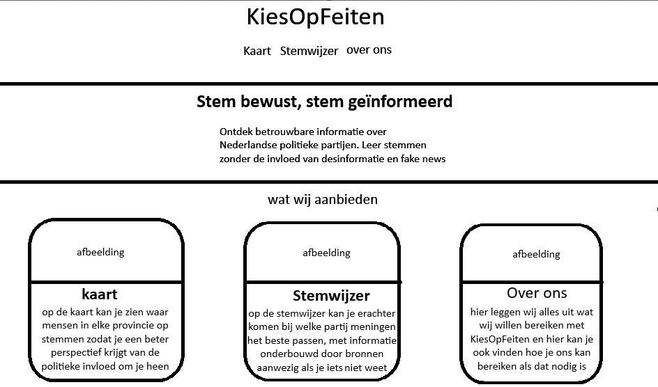
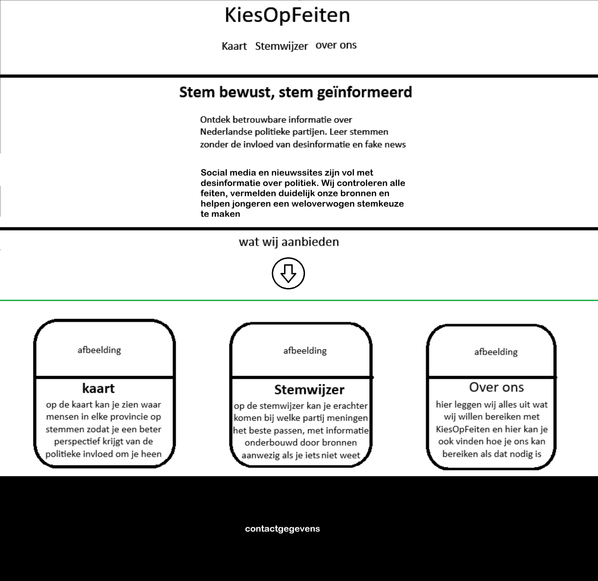
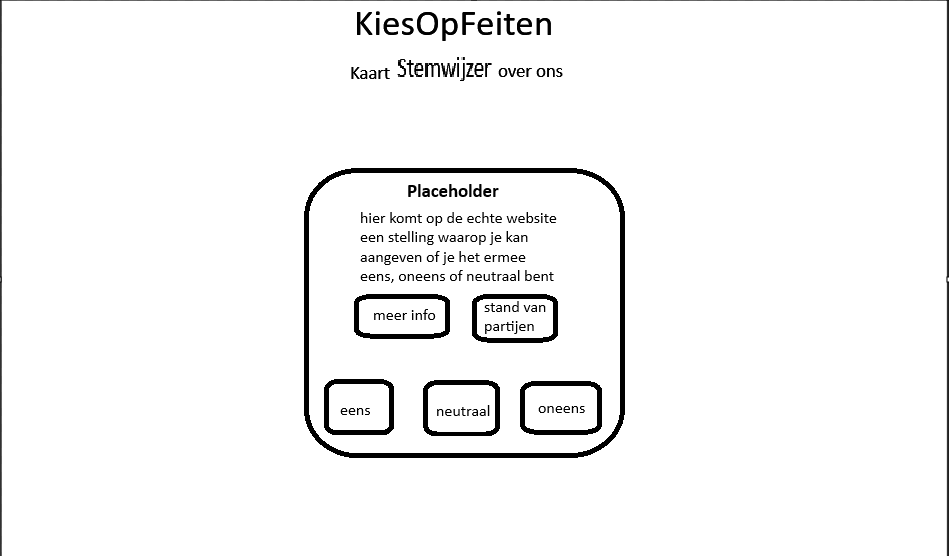
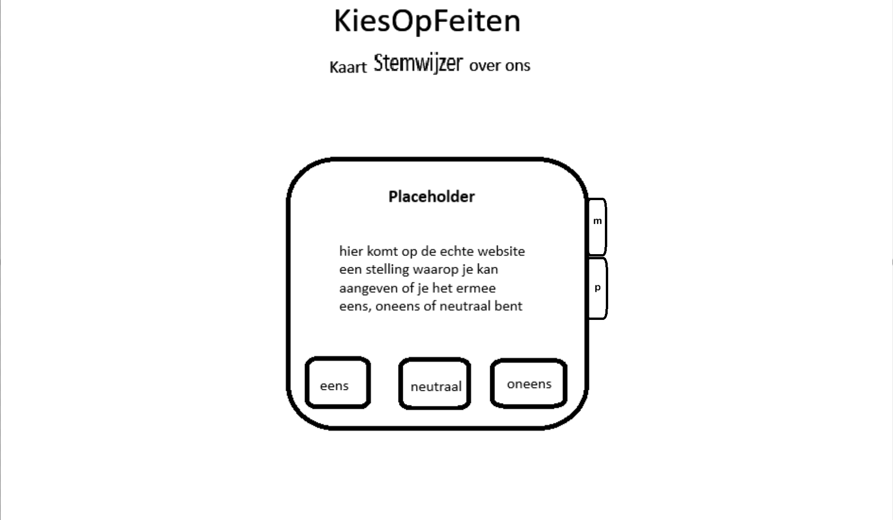

# Feedback Design Layout 2

## inhoud
 1. Feedback gever
 2. Feedback
 3. Aanpassingen

## 1. Feedback gever

ik heb feedback gekregen van: Minka Baarda
mevr. Baarda is passend als feedback gever omdat zei in onze doelgroep van 15+ valt en weinig informatie heeft wat betreft de politiek. zei heeft ook een studie gevolgd in de artistieke richting en kan dus goeie concrete feedback geven op het design.

## 2. Feedback

### feedback wireframes

#### home pagina

het ziet er al best goed uit.
de onderste 3 blokken, misschien slides ipv blokken.
te veel drukte op deze pagina.

#### Kaart pagina

goeie rustige pagina.
heel duidelijk, je ziet gelijk wat het is en je snapt wat de bedoeling is.

#### Stemwijzer pagina

iets te leeg.
    suggestie:
     in het midden de stelling met stemknoppen,
     aan de zijkanten info en partijen,
     misschien aan de hand van een booktags idee.
stellingvak niet zo vierkant, meer rechthoekig.

#### Over Ons pagina

prima idee.
A4, professioneel.

## 3. Aanpassingen

ik heb aan de pagina's: Home en Stemwijzer, aanpassingen gemaakt aan de hand van de feedback.
de aanpassingen waren:

### Home pagina

Before:

After:

Uitleg:
- de pagina is in eerste instantie zichtbaar van de boventkant tot de groene lijn
- het zwarte blok is voor belangrijke extra informatie en contactgegevens

ik heb de 3 blokken met wat wij op onze site aanbieden uit het initiele beeld geplaatst om het wat rustiger te maken. Wel houd ik duidelijk dat er meer te zien is door dit aan te geven met een pijl.

ik heb er geen slides van gemaakt omdat dat het juist ook weer leger zou maken aan de onderkant van de pagina, wat dan weer zou zorgen voor desinteresse.

### Stemwijzer pagina

Before:

After:

Uitleg:
ik vond het Lastig om te besluiten wat ik kon doen om de pagina minder leeg te maken, voor nu hou ik het wat leeg, maar als het lukt komt er nog wat opvulling.

wel heb ik bookmarks toegevoegd aan de zijkant zodat er niet zoveel knoppen zijn en het wat overzichtelijker wordt.